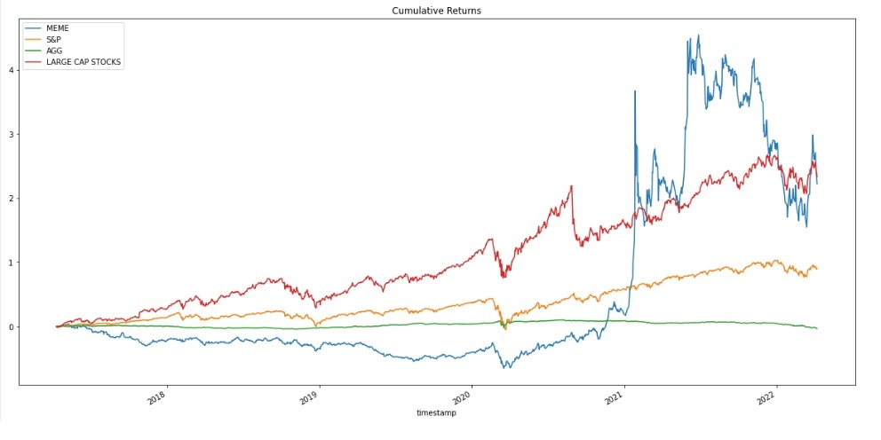

# Group 3 Project
Hypothesis: Are meme-stocks actually risky or are they worth investing in?

In 2021 with the height of the COVD pandemic, many more retail investors entered into the marketplace. Especially with the ease of investing through applications such as Robinhood, there was a surge in new investors. At the time, 'meme-stocks' became an social phenomenon. 

According to investopedia.com, a 'meme-stock' refers to "the shares of a company that have gained a cult-like following online and through social media platforms. These online communities can go on to build hype around a stock through narratives and conversations elaborated in discussion threads on websites like Reddit and posts to followers on platforms like Twitter and Facebook".  Namely $GME (Gamestop) was the forefront of this movement which started from a reddit group 'wallstreetbets'. How we define a meme-stock can be somewhat vague, but the SEC was able to identify certain characteristics of these stocks including (1) large price moves, (2) large volume changes, (3) large short interest, (4) frequent Reddit mentions, and (5) significant coverage in the mainstream media. 

Given the surge in new investors coming into the marketplace, many might ask are these 'meme-stocks' worth investing in long-term compared to traditional portfolios  such as S&P 500, Bonds ($AGG), and the top four largest stocks ($MSFT, $AMZN, $GOOG, $AAPL). In our study, we compared these four investment choices by doing a financial analysis and projection using Monte Carlo Simulation to answer this questions. Specifically, we defined 'meme-stocks' to include, $GME, $AMC, $TSLA, $BBBY, $HOOD, $BB, $PLTR, $NOK, $SPCE'; 

---

## Technologies:

The project uses python 3.7 with the following packages:

* [pandas](https://pandas.pydata.org/) - For providing data analysis and manipulation tool built on top of the Python programming language

* [numpy](https://numpy.org/doc/stable/) - It is a fundamental package for scientific computing in Python

* [hvplot](https://hvplot.holoviz.org/) - Provides an alternative for the static plotting API provided by Pandas and other libraries

* [requests](https://docs.python-requests.org/en/latest/) - For sending HTTP/1.1 requests

* [panel](https://panel.holoviz.org/) - To create custom interactive web apps and dashboards by connecting user-defined widgets to plots, images, tables, or text.

* [os](https://docs.python.org/3/library/os.html) - os module provides a portable way of using operating system dependent functionality

* [json](https://docs.python.org/3/library/json.html) - lightweight data interchange format inspired by JavaScript object literal syntax

* [load_dotenv](https://pypi.org/project/python-dotenv/) - reads key-value pairs from a .env file and can set them as environment variables

* [alpaca_trade_api](https://pypi.org/project/alpaca-trade-api/0.29/) - python library for the Alpaca trade API. It allows rapid trading algo development easily, with support for the both REST and streaming interfaces

* [MCSimulation](https://www.rdocumentation.org/packages/decisionSupport/versions/1.110/topics/mcSimulation) - generates a random sample of an output distribution defined as the transformation of an input distribution by a mathematical model

* [%matplotlib inline](https://pythonguides.com/what-is-matplotlib-inline/) -  enable the inline plotting, where the plots/graphs will be displayed just below the cell where your plotting commands are written

---

## Installation Guide


Before running the application first install the following dependencies:

```python
import os
import requests
import json
import pandas as pd
from dotenv import load_dotenv
import alpaca_trade_api as tradeapi
from MCForecastTools import MCSimulation
from alpaca_trade_api import TimeFrame
import datetime
from dateutil.relativedelta import relativedelta
import hvplot.pandas
import numpy as np
import panel as pn
from panel.interact import interact
from panel import widgets
import matplotlib.pyplot as plt


%matplotlib inline
```

---

## Usage

To run the financial tool program, simply clone the repository,  establish API keys for alpaca, and go through the written steps in the *.ipynb file.

Here is a screen shot of one of the results from our financial analysis



---

## Contributors

Sungmoo Ban, 
Ryan Johnson, 
Jung Kim, 
Jennifer Taylor, 
Danica Valera


---

## License

MIT License
